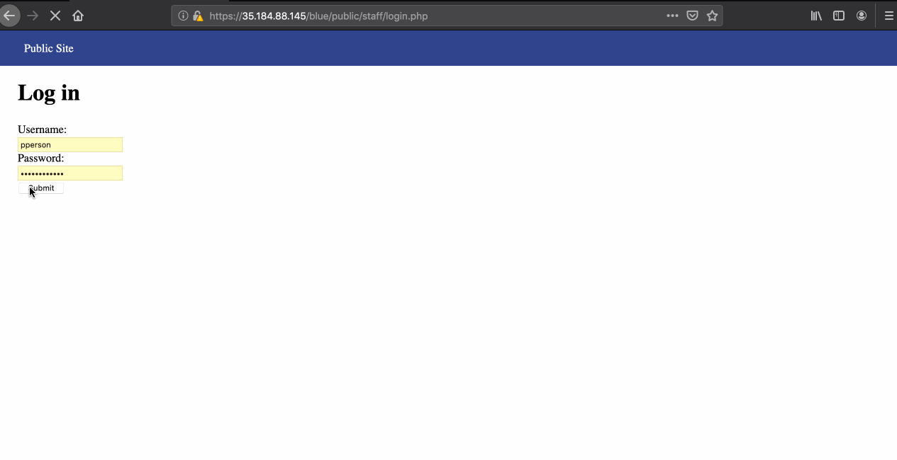
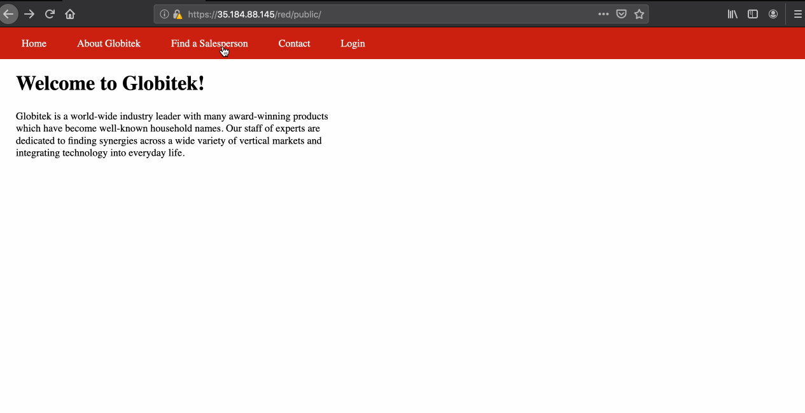

# Project 8 - Pentesting Live Targets

Time spent: **4** hours spent in total

> Objective: Identify vulnerabilities in three different versions of the Globitek website: blue, green, and red.

The six possible exploits are:
* Username Enumeration
* Insecure Direct Object Reference (IDOR)
* SQL Injection (SQLi)
* Cross-Site Scripting (XSS)
* Cross-Site Request Forgery (CSRF)
* Session Hijacking/Fixation

Each version of the site has been given two of the six vulnerabilities. (In other words, all six of the exploits should be assignable to one of the sites.)

## Blue

Vulnerability #1: Session Hijacking
We login to the compromised website with packet interception on. Inspecting the packet reveals that the sessionid field is visible as plaintext in Burp Suite. This session id is copied as is and pasted in a new window in a different browser. The user is logged in automatically without the need to enter credentials.

Vulnerability #2: __________________

## Green

Vulnerability #1: __________________

Vulnerability #2: __________________

## Red

Vulnerability #1: IDOR
The URL of the details of the Salesperson's information shows simple numerical sequencing to find user information. This can be used to find data of users, even the ones that are not listed on the page.

Vulnerability #2: __________________

## Notes

Describe any challenges encountered while doing the work
